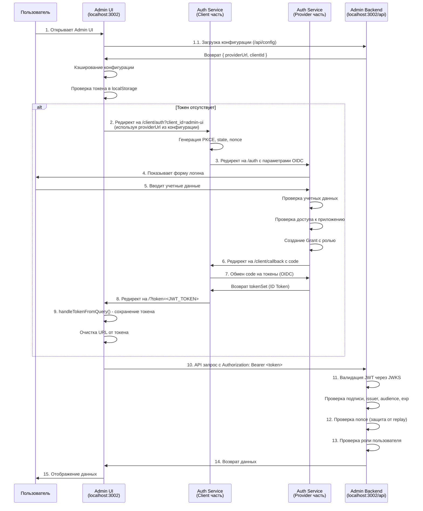
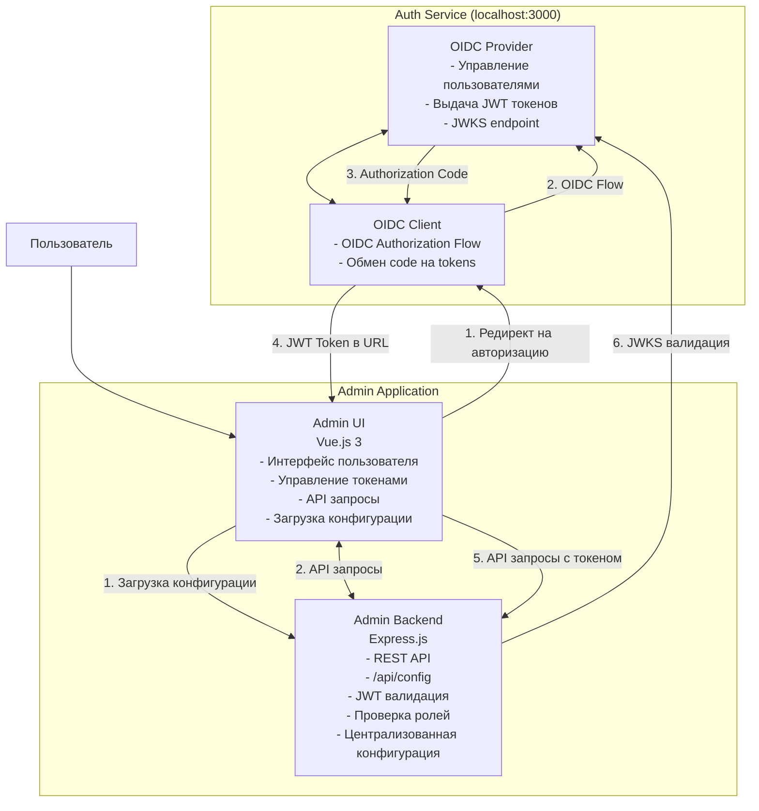

# Концепция авторизации Admin приложения

## Обзор

Данный документ описывает концепцию авторизации приложения **Admin** (состоящего из `admin-ui` и `admin-backend`) через **Auth Service** (OIDC Provider + Client).

## Архитектура компонентов

### 1. Auth Service (порт 3000)

**Auth Service** - это объединенный сервер, который выполняет две роли:

#### OIDC Provider (Авторизационный сервер)
- Управляет пользователями и их учетными данными
- Управляет списком приложений (clients)
- Хранит маппинг пользователь → приложение → роль
- Выдает JWT токены с ролью пользователя для конкретного приложения
- Предоставляет JWKS endpoint для валидации подписей токенов

#### OIDC Client (Клиентская часть)
- Обрабатывает OIDC Authorization Code flow
- Обменивает authorization code на JWT токены
- Редиректит пользователя обратно в приложение с токеном

### 2. Admin UI (порт 3002, фронтенд)

**Admin UI** - это Vue.js 3 приложение, которое:
- Отображает интерфейс для работы с Admin Backend API
- **Получает конфигурацию авторизации с Admin Backend** (не знает о провайдере напрямую)
- Инициирует процесс авторизации через редирект на Auth Service
- Получает JWT токен из query параметров после успешной авторизации
- Сохраняет токен в `localStorage`
- Автоматически добавляет токен в заголовок `Authorization: Bearer <token>` для всех API запросов
- Обрабатывает 401 ошибки и автоматически редиректит на авторизацию

### 3. Admin Backend (порт 3002, API)

**Admin Backend** - это Express.js API сервер, который:
- Раздает статические файлы Admin UI
- Предоставляет REST API endpoints (все начинаются с `/api`)
- **Предоставляет endpoint `/api/config` для получения конфигурации авторизации** (providerUrl, clientId)
- Валидирует JWT токены через middleware
- Проверяет роли пользователей для доступа к защищенным ресурсам
- Выполняет оффлайн-валидацию токенов (без обращения к Auth Service)
- **Является единой точкой конфигурации** - все настройки авторизации задаются здесь

## Поток авторизации (Authorization Flow)

### Шаг 1: Инициация авторизации

**Пользователь открывает Admin UI** (`http://localhost:3002`)

```
User → Admin UI (localhost:3002)
```

**Admin UI при инициализации:**
1. Загружает конфигурацию авторизации с Admin Backend:
   ```javascript
   // Admin UI → Admin Backend
   GET /api/config
   // Ответ: { providerUrl: 'http://localhost:3000', clientId: 'admin-ui' }
   ```
2. Кэширует конфигурацию в `sessionStorage` (TTL 5 минут)
3. Проверяет наличие токена в `localStorage`:
   - Если токен отсутствует → редирект на Auth Service
   - Если токен есть → проверяет его валидность через API запрос

**Редирект на Auth Service:**
```javascript
// Admin UI → Auth Service
// Использует providerUrl и clientId из конфигурации
GET http://localhost:3000/client/auth?client_id=admin-ui
```

### Шаг 2: OIDC Authorization Code Flow

**Auth Service (Client часть) инициирует OIDC flow:**

1. Генерирует PKCE параметры (`code_verifier`, `code_challenge`)
2. Генерирует `state` и `nonce` для безопасности
3. Сохраняет эти данные временно (до callback)
4. Редиректит на Auth Service (Provider часть):

```
Auth Service (Client) → Auth Service (Provider)
GET http://localhost:3000/auth?
  client_id=admin-ui&
  scope=openid profile email&
  response_type=code&
  redirect_uri=http://localhost:3000/client/callback&
  code_challenge=<PKCE_CHALLENGE>&
  code_challenge_method=S256&
  state=<STATE>&
  nonce=<NONCE>
```

### Шаг 3: Аутентификация пользователя

**Auth Service (Provider) показывает форму логина:**

```
User → Auth Service (Provider) - Login Form
```

**Пользователь вводит учетные данные:**
- Username: `admin`
- Password: `admin`

**Auth Service проверяет:**
1. Учетные данные пользователя
2. Доступ пользователя к приложению `admin-ui` (через маппинг ролей)
3. Если доступ есть → создает Grant с ролью пользователя
4. Автоматически выдает consent (без экрана согласия)
5. Генерирует authorization code

### Шаг 4: Обмен кода на токены

**Auth Service (Provider) редиректит обратно на Client callback:**

```
Auth Service (Provider) → Auth Service (Client)
GET http://localhost:3000/client/callback?
  code=<AUTHORIZATION_CODE>&
  state=<STATE>&
  iss=http://localhost:3000
```

**Auth Service (Client часть) обрабатывает callback:**

1. Проверяет `state` (защита от CSRF)
2. Получает PKCE данные по `state`
3. Обменивает authorization code на токены:
   ```javascript
   tokenSet = await client.callback(
     redirect_uri,
     params,
     {
       code_verifier: codeVerifier,
       state: state,
       nonce: nonce
     }
   );
   ```
4. Получает ID Token (JWT) из `tokenSet.id_token`
5. Редиректит на `redirect_url` приложения с токеном:

```
Auth Service (Client) → Admin UI
GET http://localhost:3002/?token=<JWT_TOKEN>
```

### Шаг 5: Сохранение токена в Admin UI

**Admin UI обрабатывает токен из query параметров:**

1. `handleTokenFromQuery()` извлекает токен из URL
2. Сохраняет токен в `localStorage` через `setToken()`
3. Очищает URL от токена (убирает `?token=...`)
4. Вызывает `checkAuth()` для проверки токена:
   ```javascript
   // Проверка через API запрос
   GET /api/user
   Authorization: Bearer <JWT_TOKEN>
   ```

### Шаг 6: Валидация токена в Admin Backend

**Admin Backend middleware валидирует JWT:**

```javascript
// middleware/jwt.js
validateJWT(req, res, next) {
  // 1. Извлекает токен из Authorization header
  const token = req.headers.authorization.replace('Bearer ', '');
  
  // 2. Проверяет формат JWT (3 части)
  // 3. Декодирует payload для быстрых проверок
  
  // 4. Валидирует через JWKS:
  await jwtVerify(token, jwksSet, {
    issuer: 'http://localhost:3000',
    audience: 'admin-ui'
  });
  
  // 5. Проверяет nonce (защита от replay-атак)
  // 6. Извлекает данные пользователя (sub, name, email, role)
  
  // 7. Устанавливает req.user для дальнейшего использования
  req.user = {
    sub: payload.sub,
    name: payload.name,
    email: payload.email,
    role: payload.role
  };
}
```

**Валидация включает:**
- ✅ Проверка подписи через JWKS (криптографическая валидация)
- ✅ Проверка `iss` (issuer) - должен быть `http://localhost:3000`
- ✅ Проверка `aud` (audience) - должен быть `admin-ui`
- ✅ Проверка `exp` (expiration) - токен не должен быть истекшим
- ✅ Проверка `nonce` - защита от replay-атак
- ✅ Проверка формата nonce

### Шаг 7: Проверка ролей

**Admin Backend проверяет роль для доступа к ресурсам:**

```javascript
// Только для admin
app.get('/api/admin', validateJWT, requireRole('admin'), ...);

// Для admin и user
app.get('/api/data', validateJWT, requireRole('admin', 'user'), ...);
```

**`requireRole()` middleware:**
- Проверяет наличие `req.user.role`
- Сравнивает роль пользователя с разрешенными ролями
- Возвращает 403 если роль не подходит

## Ключевые концепции

### 1. Stateless авторизация

**Admin Backend не хранит сессии:**
- Каждый запрос валидируется независимо
- Вся информация о пользователе содержится в JWT токене
- Нет необходимости обращаться к Auth Service для валидации каждого запроса

**Преимущества:**
- Масштабируемость (не нужна общая БД сессий)
- Производительность (нет сетевых запросов к Auth Service)
- Простота (меньше компонентов для управления)

### 2. Роль в JWT

**Роль пользователя встраивается в JWT токен:**

```json
{
  "sub": "admin",
  "name": "Admin User",
  "email": "admin@example.com",
  "email_verified": true,
  "role": "admin",  // ← Роль для конкретного приложения
  "nonce": "...",
  "aud": "admin-ui",
  "exp": 1768299072,
  "iat": 1768295472,
  "iss": "http://localhost:3000"
}
```

**Роль определяется маппингом:**
```javascript
// В Auth Service
const userAppRoles = {
  'admin': {
    'admin-ui': 'admin'  // Пользователь admin имеет роль admin в приложении admin-ui
  }
};
```

### 3. Защита от replay-атак

**Nonce валидация:**
- Каждый токен содержит уникальный `nonce`
- Backend отслеживает использованные токены по ключу: `nonce:sub:iat`
- Один токен может использоваться многократно (в течение срока действия)
- Разные токены с одинаковым nonce не могут быть использованы повторно

**Автоматическая очистка:**
- Использованные токены автоматически удаляются через TTL (1 час)
- Периодическая очистка старых записей (каждые 5 минут)

### 4. Автоматический редирект на авторизацию

**Admin UI автоматически обрабатывает 401 ошибки:**

```javascript
// ApiClient/interceptors.js
apiClient.interceptors.response.use(
  response => response.data,
  error => {
    if (error.response?.status === 401) {
      // Очищаем токен
      removeToken();
      // Редиректим на авторизацию
      redirectToAuth();
    }
  }
);
```

**Сценарии:**
- Токен отсутствует → редирект на авторизацию
- Токен истек → редирект на авторизацию
- Токен невалидный → редирект на авторизацию
- Backend вернул 401 → редирект на авторизацию

### 5. Единая точка управления токенами

**Все операции с токенами через `auth.js`:**

```javascript
// packages/admin-ui/src/auth.js

// Управление токенами
getToken()        // Получить токен
setToken(token)   // Сохранить токен
removeToken()     // Удалить токен
hasToken()        // Проверить наличие токена

// Конфигурация
loadAuthConfig()           // Загрузить конфигурацию с бэкенда
clearAuthConfigCache()     // Очистить кэш конфигурации

// Авторизация
redirectToAuth()           // Редирект на авторизацию (использует конфигурацию)
handleTokenFromQuery()     // Обработка токена из URL
```

**Преимущества:**
- Единая точка контроля
- Легко изменить способ хранения (localStorage → cookie → memory)
- Проще тестировать и поддерживать
- Конфигурация загружается централизованно с бэкенда

### 6. Централизованная конфигурация

**Admin UI не знает о провайдере напрямую:**

- Конфигурация (`providerUrl`, `clientId`) загружается с Admin Backend через `/api/config`
- Кэширование конфигурации в `sessionStorage` (TTL 5 минут)
- Fallback на значения по умолчанию при ошибке загрузки
- Все настройки авторизации задаются в Admin Backend

**Преимущества:**
- ✅ Декoupling: Admin UI не зависит от конкретного провайдера
- ✅ Гибкость: можно изменить провайдера без изменения фронтенда
- ✅ Централизация: одна точка конфигурации (Admin Backend)
- ✅ Простота: настройка только в одном месте

## Безопасность

### 1. PKCE (Proof Key for Code Exchange)

**Защита authorization code flow:**
- `code_verifier` генерируется случайно
- `code_challenge` = SHA256(code_verifier)
- При обмене кода проверяется соответствие

### 2. State и Nonce

**State:**
- Защита от CSRF атак
- Генерируется случайно для каждого flow
- Проверяется при callback

**Nonce:**
- Защита от replay-атак
- Встраивается в ID Token
- Проверяется при валидации токена

### 3. JWKS валидация

**Криптографическая проверка подписи:**
- Backend получает публичные ключи из JWKS endpoint
- Проверяет подпись токена используя правильный ключ (по `kid`)
- Гарантирует, что токен был выдан Auth Service

### 4. Audience проверка

**Токен привязан к конкретному приложению:**
- `aud: "admin-ui"` - токен выдан только для admin-ui
- Backend проверяет, что токен предназначен для него
- Предотвращает использование токенов от других приложений

## Диаграмма потока



### Диаграмма архитектуры компонентов



## Конфигурация

### Auth Service

**Пользователи:**
```javascript
const users = [
  { id: 'admin', name: 'Admin User', email: 'admin@example.com', password: 'admin' }
];
```

**Приложения:**
```javascript
const applications = [
  { 
    client_id: 'admin-ui',
    name: 'Admin UI',
    secret: 'admin-ui-secret',
    redirect_url: 'http://localhost:3002/'
  }
];
```

**Маппинг ролей:**
```javascript
const userAppRoles = {
  'admin': {
    'admin-ui': 'admin'
  }
};
```

### Admin UI

**Конфигурация загружается с Admin Backend:**
```javascript
// packages/admin-ui/src/auth.js
// Конфигурация НЕ хардкодится, а загружается с бэкенда

// При инициализации приложения:
const config = await loadAuthConfig();
// GET /api/config
// Ответ: { providerUrl: 'http://localhost:3000', clientId: 'admin-ui' }

// Конфигурация кэшируется в sessionStorage (TTL 5 минут)
// Fallback значения (если загрузка не удалась):
// providerUrl: 'http://localhost:3000'
// clientId: 'admin-ui'
```

### Admin Backend

**Конфигурация (единая точка настройки):**
```javascript
// packages/admin-backend/index.js
const PROVIDER_URL = process.env.PROVIDER_URL || 'http://localhost:3000';
const CLIENT_ID = process.env.CLIENT_ID || 'admin-ui';

// Endpoint для предоставления конфигурации клиентам
app.get('/api/config', (req, res) => {
  res.json({
    providerUrl: PROVIDER_URL,
    clientId: CLIENT_ID,
  });
});

// JWT middleware использует ту же конфигурацию
const { validateJWT, requireRole } = createJWTMiddleware({
  providerUrl: PROVIDER_URL,
  clientId: CLIENT_ID,
});
```

**Преимущества централизованной конфигурации:**
- ✅ Все настройки авторизации в одном месте
- ✅ Легко изменить провайдера (меняем только в Admin Backend)
- ✅ Admin UI не знает о провайдере напрямую
- ✅ Можно использовать переменные окружения для разных сред

## Заключение

Данная архитектура обеспечивает:
- ✅ Безопасную авторизацию через OIDC
- ✅ Stateless валидацию токенов
- ✅ Ролевой доступ к ресурсам
- ✅ Автоматическую обработку истекших токенов
- ✅ Защиту от replay-атак
- ✅ Масштабируемость и производительность
- ✅ Централизованную конфигурацию (Admin Backend - единая точка настройки)
- ✅ Декoupling компонентов (Admin UI не знает о провайдере напрямую)